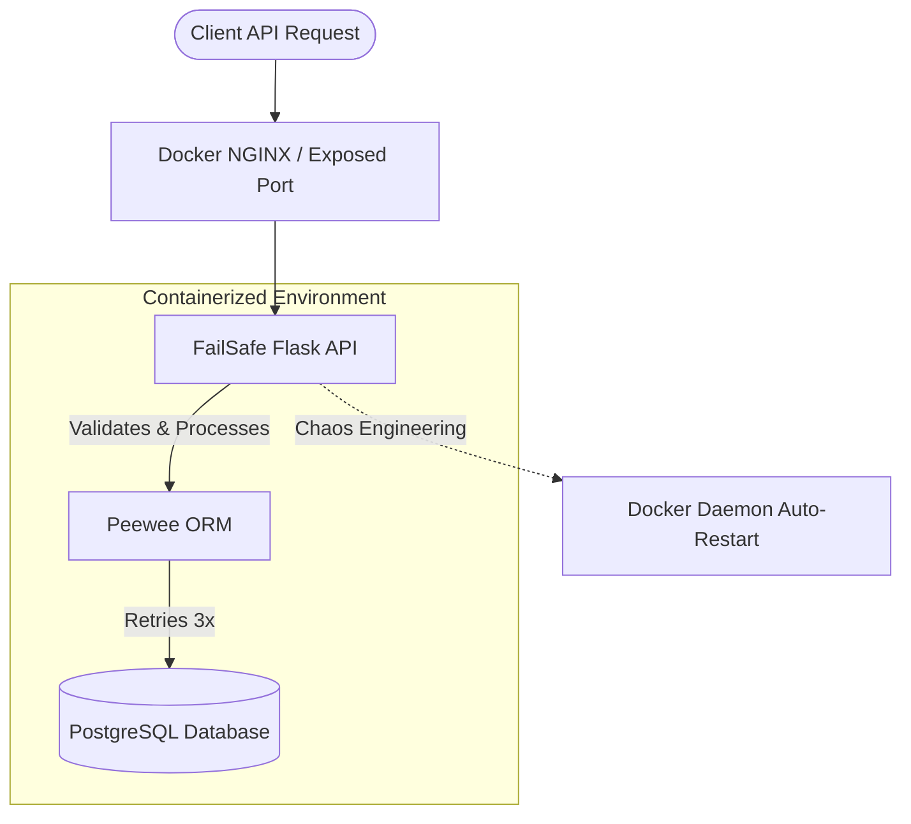

# 🧯 FailSafe Social API

> **Production Engineering Hackathon 2026 - Reliability Track Submission**
> A highly resilient, fault-tolerant social backend engineered to survive database outages, container crashes, and malicious inputs.

## 🗺️ The Map (Bronze Tier)

### Architecture Diagram


### 🛠️ Quick Start (Setup Instructions)
This setup is designed so anyone can easily build and run the application. 
1. **Clone the Repo:**
   `git clone https://github.com/your-username/failsafe-social-api.git`
2. **Setup the Environment:**
   Copy `.env.example` to `.env` (it contains safe defaults for the hackathon).
3. **Launch the Infrastructure:**
   ```bash
   docker-compose up --build
   ```
   The API will automatically spin up on `http://localhost:5000` and self-heal if interrupted.

### 📡 Core API Endpoints
- **`GET /health`**
  - **Purpose:** Checks the application pulse and measures DB connection latency.
  - **Returns:** System health and latency in milliseconds.
- **`POST /users`**
  - **Purpose:** Securely create a new user account.
  - **Payload:** `{"name": "...", "email": "...", "age": 25}`
  - **Returns:** Created user ID and data, or `400` if invalid.
- **`GET /users`**
  - **Purpose:** Retrieve all registered users.
- **`POST /posts`**
  - **Purpose:** Publish a new social post.
  - **Payload:** `{"user_id": 1, "content": "Hello World!"}`
  - **Returns:** Created post metadata.
- **`GET /posts`**
  - **Purpose:** View the global feed of all posts.

---

## 📖 The Manual (Silver Tier)
For operators, please see the following guides:
- [**Deployment Guide**](docs/DEPLOY.md) (How to ship and rollback)
- [**Troubleshooting Guide**](docs/TROUBLESHOOTING.md) (Bugs faced, configuration list, how to fix things)

---

## 🏛️ The Codex (Gold Tier)
For on-call and system design reviews, consult the codex:
- [**Incident Runbooks**](docs/RUNBOOK.md) (Action guides for 3 AM alerts)
- [**Architecture Decision Log**](docs/DECISIONS.md) (Why we chose this stack)
- [**Capacity Plan**](docs/CAPACITY.md) (When we break and how we scale)
- [**System Failure Modes**](FAILURE_MODES.md) (Our chaotic responses)
